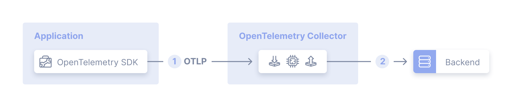

# demo-tracing

## Introduction

The aim of this project is to demonstrate the use of tracing opentelemetry with Java and Spring Boot.

The opentelemetry project is an attempt to unify a complex, vendor-specific multitude of SDKs, agents and configuration
procedures, thereby allowing to make projects vendor-specific and independent of their specific SDKs.

A change of vendor will therefore not have any impact on the code base, just on configuration.

This project only covers the distributed tracing for a very simple architecture (one service + mongoDB), using (to
my knowledge) the state of the art and prioritising the use of OTLP over vendor-specific protocols, in order to
achieve maximum vendor independence.

Collection of logs and metrics is out of scope.

## High level design

This project implements this kind of deployment, as described [here](https://opentelemetry.io/docs/collector/deployment/agent/)

A few clarifications:

- the `Application` is a dummy Spring Boot REST API
- instead of using the `OpenTelemetry SDK`, I opted for letting the `opentelemetry-javaagent` attach to the JVM and
  collect traces ([Zero-code instrumentation](https://opentelemetry.io/docs/zero-code/java/agent/)). [Code-based](https://opentelemetry.io/docs/concepts/instrumentation/code-based/) instrumentation is
  also possible
- the `OpenTelemtry Collector` is deployed via docker, see [`compose.yml`](compose.yml), and is configured in 
  [`collector-config.yml`](src/main/resources/collector-config.yml) to receive and export data via `OTLP` 
  (OpenTelemetry Protocol)
- the `Backend` is Jaeger, but any tool to visualize distributed traces will do. I chose Jaeger because it's 
  opensource, easy to get up&running and supports OTLP. It can be further integrated into a full observability 
  solution thanks to Grafana (out of scope)

## Quick start

You will need `podman` or `docker` installed, along with `compose`.

Run command `podman compose up -d --build` or `docker compose up -d --build`.

Send a request to the REST API via `curl localhost:8080/persons`.

Open the Jaeger web UI at `localhost:16686` and you should see a new trace.

## Feedback

For any feedback or appreciation, feel free to reach out via the [Issues section](https://github.com/andreaippo/demo-tracing/issues) or Star this repo 🙏.

I'm also on [LinkedIn](https://github.com/andreaippo/demo-tracing/issues).
